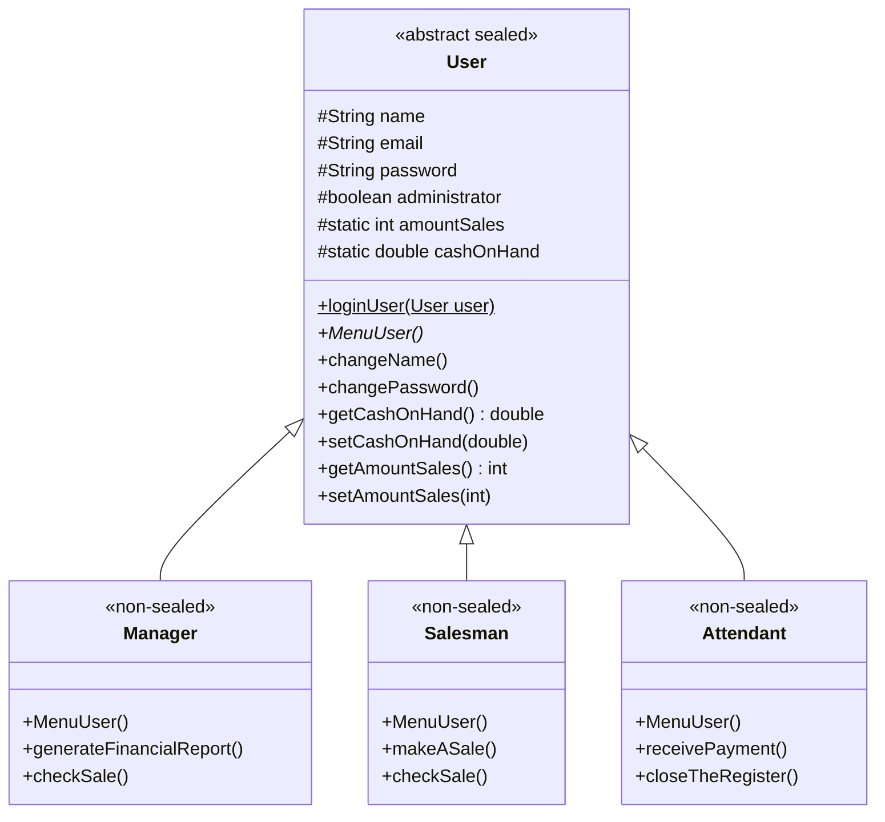

# 👥 User Hierarchy System in Java

<p align="center">
  
  
  
  
</p>

<p align="center">
  Sistema em console desenvolvido em <b>Java</b> demonstrando hierarquia de usuários corporativos, controle de acesso e recursos modernos de <b>Orientação a Objetos</b> como <i>Sealed Classes</i> e polimorfismo.
</p>

---

## 📌 Sumário

- [Visão Geral](#-visão-geral)
- [Hierarquia e Papéis](#-hierarquia-e-papéis)
- [Diagrama de Classes](#-diagrama-de-classes)
- [Credenciais para Teste](#-credenciais-para-teste)
- [Tecnologias e Destaques Técnicos](#-tecnologias-e-destaques-técnicos)
- [Estrutura do Projeto](#-estrutura-do-projeto)
- [Como Executar](#-como-executar)
- [Autor](#-autor)

---

## 🚀 Visão Geral

O **User Hierarchy System** simula um ambiente corporativo comercial com diferentes níveis de permissões e operações específicas para cada tipo de usuário.

O sistema conta com fluxo de login seguro por e-mail e senha, permitindo que cada usuário acesse exclusivamente as ferramentas pertinentes ao seu cargo dentro da organização.

---

## 👔 Hierarquia e Papéis

| Perfil | Descrição | Funcionalidades Exclusivas |
| :--- | :--- | :--- |
| **👔 Gerente (`Manager`)** | Administrador geral do negócio | • Gerar relatório financeiro do caixa<br>• Consultar total de vendas realizadas<br>• Alteração de credenciais (nome/senha) |
| **💼 Vendedor (`Salesman`)** | Responsável pelas operações de vendas | • Registrar nova venda<br>• Consultar volume de vendas da loja<br>• Alteração de credenciais (nome/senha) |
| **🛎️ Atendente (`Attendant`)** | Operador de frente de caixa | • Receber pagamentos (incrementa caixa)<br>• Fechar o caixa e visualizar saldo final<br>• Alteração de credenciais (nome/senha) |

---

## 📊 Diagrama de Classes

A arquitetura utiliza **Sealed Classes** (classes seladas) do Java, garantindo que apenas classes autorizadas possam estender a classe base `User`:



---

## 🔑 Credenciais para Teste

Ao iniciar a aplicação, os seguintes usuários já se encontram pré-carregados para testes imediatos:

| Perfil | Nome | E-mail | Senha |
| :--- | :--- | :--- | :--- |
| **Gerente** | `Hudson Costa` | `Hudson@gmail.com` | `1234` |
| **Vendedor** | `Carlos Daniel` | `Carlos@gmail.com` | `56789` |
| **Atendente** | `Igor Lopes` | `Igor@gmail.com` | `146832` |

---

## 🛠️ Tecnologias e Destaques Técnicos

- **Java 17+**: Aplicação construída tirando proveito dos padrões modernos da linguagem.
- **Sealed Classes (`sealed` / `non-sealed` / `permits`)**: Restringe a herança de `User` exclusivamente para `Manager`, `Salesman` e `Attendant`, aumentando a integridade do domínio.
- **Polimorfismo**: O método abstrato `MenuUser()` é implementado dinamicamente para cada perfil no momento da autenticação.
- **Switch Expressions**: Controle de fluxo moderno e legível com sintaxe de seta (`->`).
- **Inferência de Tipo Local (`var`)**: Código mais limpo e conciso nas instanciações.

---

## 📁 Estrutura do Projeto

```text
user-hierarchy-java/
│
├── src/
│   ├── App.java          # Ponto de entrada (Main) e menu inicial interativo
│   ├── User.java         # Classe base abstrata selada com autenticação e dados comuns
│   ├── Manager.java      # Implementação das regras e menu do Gerente
│   ├── Salesman.java     # Implementação das regras e menu do Vendedor
│   └── Attendant.java    # Implementação das regras e menu do Atendente
│
├── .gitignore            # Arquivos ignorados pelo Git
└── README.md             # Documentação do projeto
```

---

## 💻 Como Executar

### Pré-requisitos

- **JDK 17** ou superior instalado.
- Terminal / Linha de comando (PowerShell, Bash, CMD).

### Passo a passo

1. **Clone o repositório:**
   ```bash
   git clone https://github.com/Hudson390/user-hierarchy-java.git
   cd user-hierarchy-java
   ```

2. **Compile as classes:**
   ```bash
   javac -d bin src/*.java
   ```

3. **Execute a aplicação:**
   ```bash
   java -cp bin App
   ```

   *(Alternativamente, se preferir compilar e rodar direto da pasta `src`:)*
   ```bash
   cd src
   javac *.java
   java App
   ```

4. **Navegue pelo menu:** Escolha o tipo de perfil desejado, digite o e-mail e a senha correspondentes e explore as operações!

---

## 👨‍💻 Autor

Desenvolvido por **Hudson Costa**  
GitHub: [@Hudson390](https://github.com/Hudson390)
